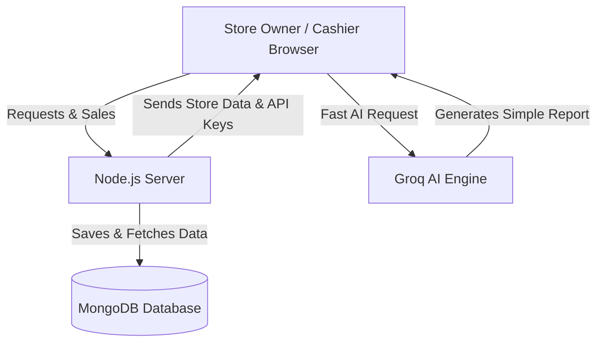
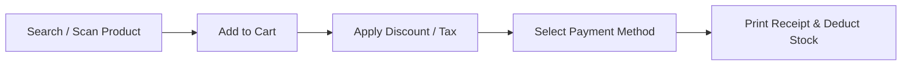
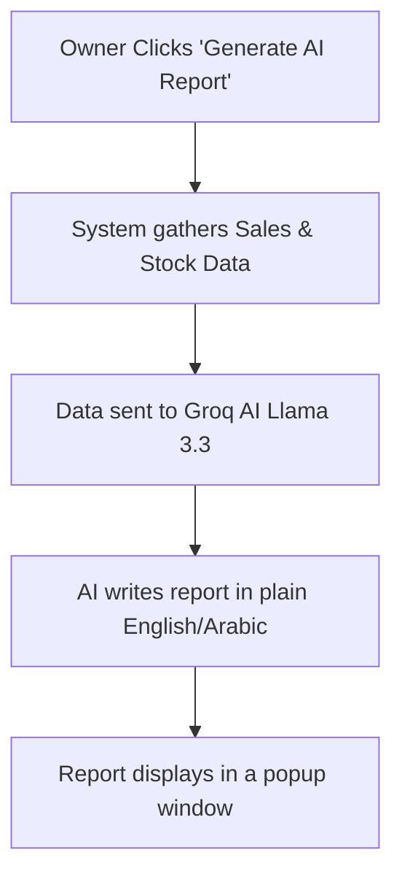
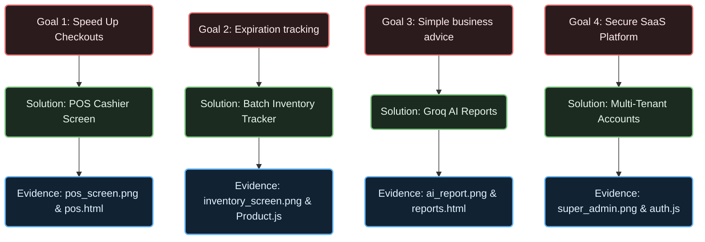
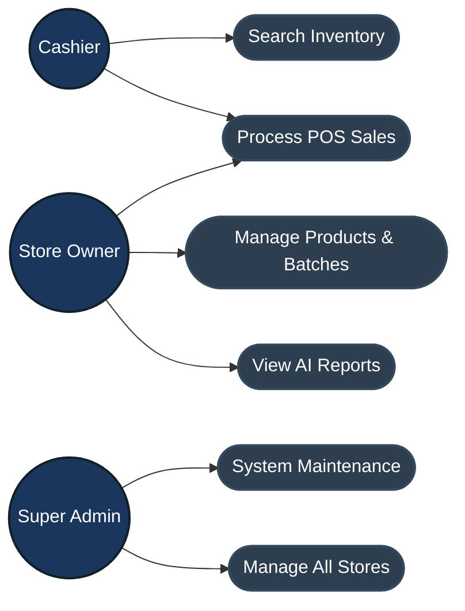
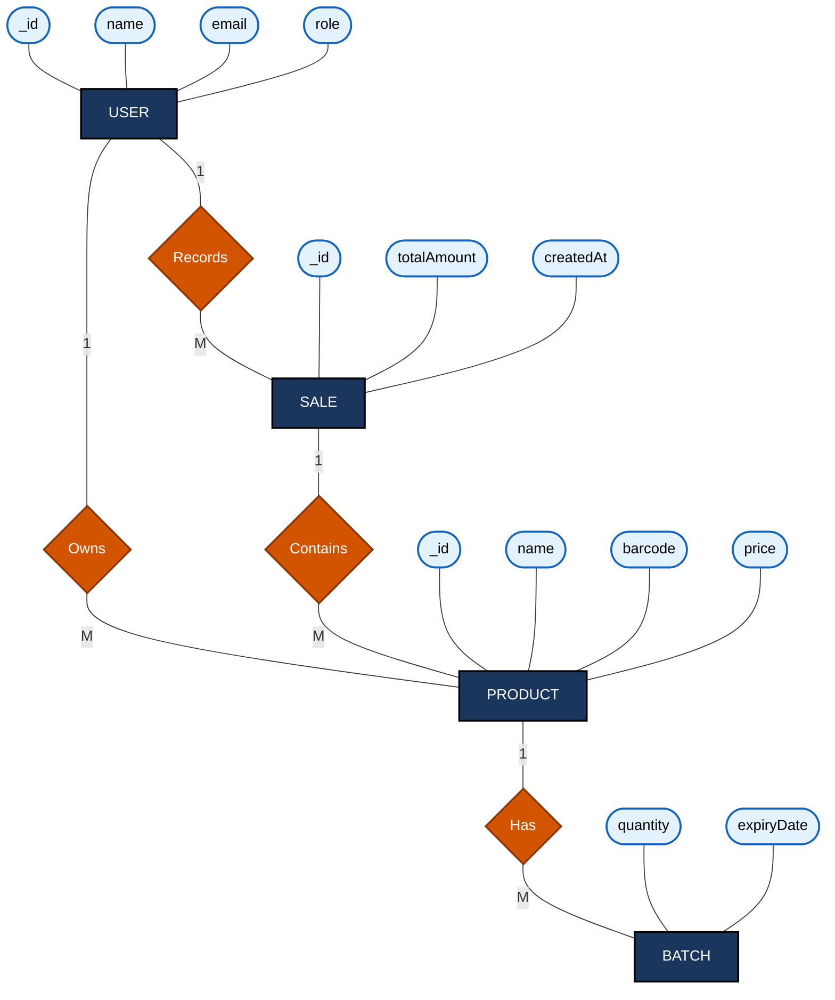

# Diagrams Generator Guide for Chapter 5

This file contains the codes and instructions for generating the visual diagrams needed for your report. 

### How to turn these codes into PNG images:
1. Go to the free website: **[https://mermaid.live](https://mermaid.live)**.
2. Copy the code block of the diagram you want from below.
3. Paste the code into the text editor panel on the left side of the website.
4. On the bottom-left panel of the website, click **Actions** -> **Download PNG**.
5. Save the image on your computer, and insert it into your final report document where marked.

---

### 1. System Architecture Diagram
**Filename to save as:** `system_architecture.png`
**Code to copy:**

---

### 2. POS Checkout Workflow Diagram
**Filename to save as:** `pos_workflow.png`
**Code to copy:**

---

### 3. AI Report Workflow Diagram
**Filename to save as:** `ai_workflow.png`
**Code to copy:**

---

### 4. Objective-to-Result Mapping Diagram
**Filename to save as:** `objective_mapping.png`
**Code to copy:**

### 5. Use Case Diagram (Chapter 4)
**Filename to save as:** `use_case_diagram.png`
**Code to copy:**

---

### 6. ERD / Database Schema Diagram (Chapter 4)
**Filename to save as:** `erd_diagram.png`
**Code to copy:**

