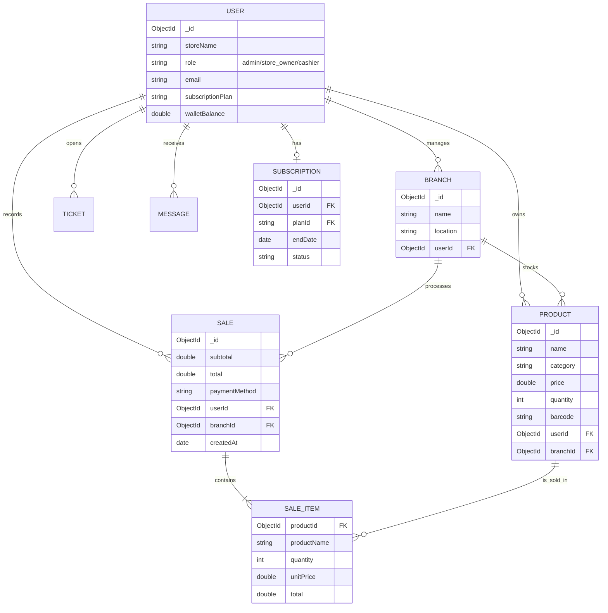

# 📊 مخططات هندسة البيانات (Database Diagrams & ERD)
**مشروع SmartGrocer - نظام إدارة المتاجر السحابي (SaaS)**

---

## 🖼️ الرسم التخطيطي البصري (Visual ERD Diagram)

---

## 1. مخطط علاقات الكيانات التقني (Technical Mermaid ERD)
يوضح هذا المخطط العلاقات المنطقية بين الجداول الأساسية في قاعدة البيانات (User, Product, Sale, Branch, Subscription).

---

## 2. شرح معماري لقاعدة البيانات (Database Architecture)

يعتمد مشروع **SmartGrocer** على قاعدة بيانات **MongoDB (NoSQL)**، وقد تم تصميمها لتتبع منهجية **(Database-per-Tenant)** برمجياً وليس فيزيائياً لضمان السرعة:

### 👤 كيان المستخدم (User Entity)
- هو الكيان المحوري (Central Entity).
- يمثل "التاجر" أو "المسؤول".
- يحتوي على بيانات الاشتراك (SaaS Subscription) وحالة الحساب.
- **العلاقة:** (One-to-Many) مع كافة الكيانات الأخرى (صاحب متجر واحد يمتلك عدة منتجات ومبيعات).

### 📦 كيان المنتج (Product Entity)
- يحتوي على تفاصيل المخزون والأسعار.
- يدعم **بنية الفروع (Branches)**: كل منتج مرتبط بمستخدم (Owner) وبفرع محدد.
- **الحقول الذكية:** يحتوي على حقول للباركود وتاريخ الصلاحية وتنبيهات النواقص.

### 💰 كيان المبيعات (Sales & Sale Items)
- مصمم بنظام **Embedded Documents**: حيث يتم تخزين عناصر الفاتورة (Items) داخل وثيقة المبيعات نفسها لتقليل عمليات الـ (Joins) وتسريع استخراج التقارير.
- يربط المبيعات بالمستخدم والفرع لضمان دقة التقصي (Audit Trail).

### 📍 كيان الفروع (Branch Entity)
- يسمح للتجار بإدارة عدة مواقع جغرافية تحت حساب واحد.
- يتم فلترة كافة البيانات (المنتجات والمبيعات) بناءً على معرف الفرع.

### 🎫 الدعم والرسائل (Tickets & Messages)
- نظام فرعي لإدارة التواصل بين الأدمن والتاجر.
- **العلاقة:** ترتبط دائماً بمعرف التاجر لضمان الخصوصية.

---

## 3. لماذا NoSQL لهذا المشروع؟ (Justification)
1.  **مرونة المخطط (Schema Flexibility):** يمكن إضافة حقول جديدة للمنتجات (مثل لون المنتج أو حجمه) لبعض المتاجر دون الحاجة لتحديث هيكل القاعدة لكل المستخدمين.
2.  **السرعة (Performance):** نظراً لاعتماد الـ POS على قراءات الـ Barcode السريعة، فإن استجابة MongoDB اللحظية (Low Latency) هي الأنسب.
3.  **قابلية التوسع (Horizontal Scaling):** النظام مهيأ للنمو عبر خاصية الـ Sharding لدعم آلاف المتاجر مستقبلاً.

---
**حقوق التوثيق: مشروع SmartGrocer - 2026**
